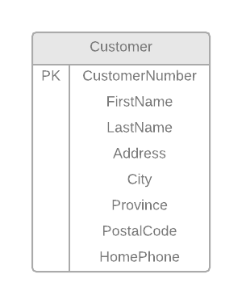
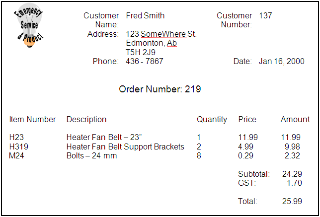
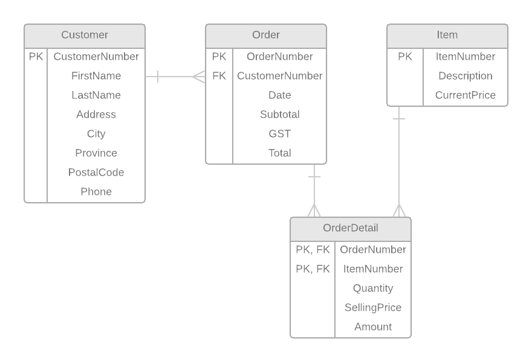

# ESP Document 1

This is a sample solution of normalizing the **Customer Details View** and the **Customer Orders View** in ESP Document 1.

## Legend

This legend is a guide to reading and interpreting the table listings under 0NF through 3NF.

- **TableName:** - Table names will be bolded and end with a colon. (e.g.: `**TableName:**`)
- (Column, Names) - Column names for a table will be enclosed in (rounded parenthesis).
- <b class="pk">PrimaryKeyFields</b> - Primary key fields will be bold and inside a box. (e.g: `<b class="pk">PrimaryKeyFields</b>`)
- <u class="fk">ForeignKeyFields</u> - Foreign key fields will be a wavy underline in italic and green. (e.g.: `<u class="fk">ForeignKeyFields</u>`)
- <b class="gp">{</b>Repeating Groups<b class="gp">}</b> - Groups of repeating fields will be identified in 0NF stage, and will be enclosed in orange curly braces. (e.g.: `<b class="gp">{</b>Repeating, Group, Fields<b class="gp">}</b>`)

----

## Customer Details View

The Customer Details View and its resulting tables are based on the following form (taken from the original documentation).

This form was analyzed according to the rules of 0NF (Zero-Normal Form), 1NF (First-Normal Form), 2NF (Second-Normal Form), and 3NF (Third-Normal Form).

### 0NF

After performing Zero-Normal Form, a single table was generated: **Customer**.

**Customer:** (<b class="pk">CustomerNumber</b>, FirstName. LastName, Address, City, Province, PostalCode, HomePhone)

### 1NF – 3NF

No changes to the table in 1NF to 3NF.

### ERD

The following ERD represents the tables/entities from the **Customer Details View**.

----

## Customer Orders View

The Customer Orders View and its resulting tables are based on the following form (taken from the original documentation).

 
This form was analyzed according to the rules of 0NF (Zero-Normal Form), 1NF (First-Normal Form), 2NF (Second-Normal Form), and 3NF (Third-Normal Form).

### 0NF

After performing Zero-Normal Form, a single table was generated: **Order**.

**Order:**	(CustomerNumber, FirstName, LastName, Address, City, Province, PostalCode, Phone, Date, <b class="pk">OrderNumber</b>, <b class="gr">{</b>ItemNumber, Description, Quantity, CurrentPrice, SellingPrice, Amount<b class="gr">}</b>, Subtotal, GST, Total)

### 1NF

After performing First-Normal Form, a new table was generated: **OrderDetail**.

**Order:** (CustomerNumber, FirstName, LastName, Address, City, Province, PostalCode, Phone, Date, <b class="pk">OrderNumber</b>, Subtotal, GST, Total)

**OrderDetail:** (<b class="pk"><u class="fk">OrderNumber</u>, ItemNumber</b>, Description, Quantity, CurrentPrice, SellingPrice, Amount)

### 2NF

After performing Second-Normal Form, another new table was generated: **Item**.

**OrderDetail**	(<b class="pk"><u class="fk">OrderNumber</u>, ItemNumber</b>, Quantity,  SellingPrice, Amount)

**Item**	(<b class="pk">ItemNumber</b>, Description, CurrentPrice)

### 3NF

After performing Third-Normal Form, another new table was generated: **Customer**.

**Order**	(<b class="pk">OrderNumber</b>, <u class="fk">CustomerNumber</u>, Date, Subtotal, GST, Total)

**Customer**	(<b class="pk">CustomerNumber</b>, FirstName, LastName, Address, City, Province, PostalCode, Phone)

### Tables after 3rd Normal Form

These are the tables/entities after normalizing the Customer Details View.

**Order**	(<b class="pk">OrderNumber</b>, <u class="fk">CustomerNumber</u>, Date, Subtotal, GST, Total)

**OrderDetail**	(<b class="pk"><u class="fk">OrderNumber</u>, <u class="fk">ItemNumber</u></b>, Quantity,  SellingPrice, Amount)

**Item**	(<b class="pk">ItemNumber</b>, Description, CurrentPrice)

**Customer**	(<b class="pk">CustomerNumber</b>, FirstName, LastName, Address, City, Province, PostalCode, Phone)

#### Verification

> **Note:** This "verification" section would not be required on a lab. It's here for demonstration purposes only, as a step you would do on your own to see if the data "fits" your final set of normalized entitied.

The verification of the final set of entities after going through the normalization process can be demonstrated by drawing tables with the original document's data entered as a sample.

> **Order** Table

OrderNumber | CustomerNumber | Date | Subtotal | GST | Total
------------|----------------|------|----------|-----|-----
<b class="pk">219</b> | <u class="fk">137</u> | Jan 16, 2000 | 24.29 | 1.70 | 25.99

> **Customer** Table

CustomerNumber | FirstName | LastName | Address | City | Province | PostalCode | HomePhone
---------------|-----------|----------|---------|------|-----------|------------|---------
<b class="pk">137</b> | Fred | Smith | 123 SomeWhere St. | Edmonton | AB | T5H 2J9 | 436-7867

> **OrderDetail** Table

OrderNumber | ItemNumber | Quantity | SellingPrice | Amount
------------|------------|----------|--------------|------
<b class="pk"><u class="fk">219</u></b> | <b class="pk"><u class="fk">H23</u></b> | 1 | 11.99 | 11.99
<b class="pk"><u class="fk">219</u></b> | <b class="pk"><u class="fk">H319</u></b> | 2 | 4.99 | 9.98
<b class="pk"><u class="fk">219</u></b> | <b class="pk"><u class="fk">M24</u></b> | 8 | 0.29 | 2.32

> **Item** Table

ItemNumber | Description | CurrentPrice&dagger;
-----------|-------------|-------------
<b class="pk">H23</b> | Heater Fan Belt - 23" | 11.99
<b class="pk">H319</b> | Heater Fan Belt Support Brackets | 4.99
<b class="pk">M24</b> | Bolts - 24 mm | 0.29

**&dagger;** - *The current price for items can change over time.*

### Customer Orders View ERD

The following ERD for the *Customer Orders View* is based on the final 3rd normal form.

#### ERD Description

> **Note:** This "ERD Description" section would not be required on a lab. It's here for demonstration purposes only, as a step you would do on your own to see if the structure/relationships *make sense* among your final set of normalized entitied.
 
- Each **Customer** *must be* <u>one who places</u> *one or more* **Order**s.
- Each **Order** *must be* <u>placed by</u> *one and only one* **Customer**.
- Each **Order** *must be* <u>made up of</u> *one or more* **OrderDetail**s.
- Each **OrderDetail** *must be* <u>for</u> *one and only one* **Order**.
- Each **Item** *may be* <u>sold under</u> *one or more* **OrderDetail**s.
- Each **OrderDetail** *must be* <u>a sale of</u> *one and only one* **Item**.

