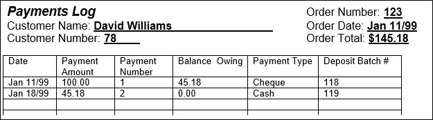
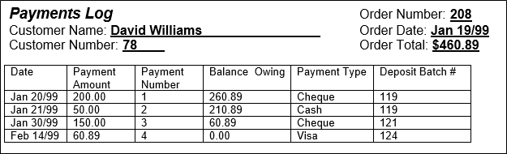
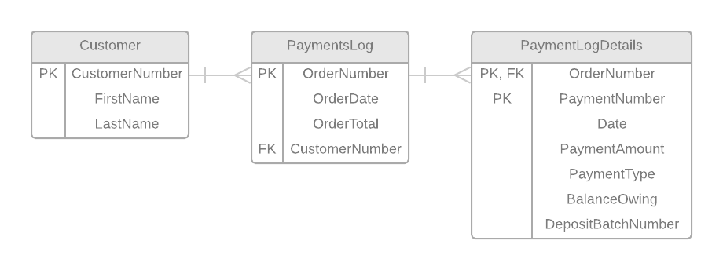

# ESP Document 2

The second specifications document for Emergency Service & Product (ESP) presented one additional paper-based form: **Customer Payments Against Orders**. This portion of the sample lab solution details how this form was analyzed and into an integrated database design. The styling conforms to the associated [Legend.md](normalization legend).

## Customer Payments Against Orders

The Customer Payments Against Orders and its resulting tables are based on the following form (taken from the original documentation).

> **NOTE:** It can be helpful to see more samples of a given form/view in order to better understand the data and metadata. Here are a few more Payment Logs to consider in your analysis.

 
This form was analyzed according to the rules of 0NF (Zero-Normal Form), 1NF (First-Normal Form), 2NF (Second-Normal Form), and 3NF (Third-Normal Form).

### 0NF

After performing Zero-Normal Form, a single table was generated: **PaymentsLog**.

**PaymentsLog:** (OrderNumber, OrderDate, OrderTotal, FirstName, LastName, CustomerNumber, {Date, PaymentAmount, PaymentNumber, BalanceOwing, PaymentType, DepositBatchNumber})

### 1NF

After performing First-Normal Form, a single table was generated: **PaymentLogDetails**.

**PaymentsLog:** (OrderNumber, OrderDate, OrderTotal, FirstName, LastName, CustomerNumber)

**PaymentLogDetails:** (<b class="pk"><u class="fk">OrderNumber</u>, PaymentNumber</b>, Date, PaymentAmount, BalanceOwing, PaymentType, DepositBatchNumber)

### 2NF

After examining the *PaymentLogDetails*, there were no changes.

> **Note:** When analyzing the *PaymentNumber* in the *PaymentLogDetails* entity, it became apparent (only through looking at additional Payments Log forms) that each Payment Log had their Payment Numbers re-starting at the value 1. As a result, this *PaymentNumber* is itself tightly tied to the *OrderNumber* and none of the other attributes in the entity are tied closely to just the *PaymentNumber* (though some seem to be more related to each other, which is dealt with in 3NF below).

### 3NF

After performing Third-Normal Form, a two tables were generated: Customer, and **Payment**.

**Customer:** (<b class="pk">CustomerNumber</b>, FirstName, LastName)

**PaymentsLog:** (<b class="pk">OrderNumber</b>, OrderDate, OrderTotal, <u class="fk">CustomerNumber</u>)

**PaymentLogDetails:** (<b class="pk"><u class="fk">OrderNumber</u>, PaymentNumber</b>, Date, PaymentAmount, PaymentType, BalanceOwing, DepositBatchNumber)

### Tables after 3rd Normal Form

These are the tables/entities after normalizing the Payment Log View.

**Customer:** (<b class="pk">CustomerNumber</b>, FirstName, LastName)

**PaymentsLog:** (<b class="pk">OrderNumber</b>, OrderDate, OrderTotal, <u class="fk">CustomerNumber</u>)

**PaymentLogDetails:** (<b class="pk"><u class="fk">OrderNumber</u>, PaymentNumber</b>, Date, PaymentAmount, PaymentType, BalanceOwing, DepositBatchNumber)

### ERD

----

