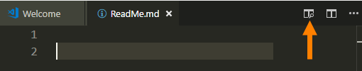

# DMIT-1508 - Database Fundamentals - Section A01 (2018 Jan)

## Developer Environments for This Course

Our main tools are going to be

- GitHub Desktop (for version control)
- Visual Studio Code (for normalization documents)
- LucidChart (for ERDs)
- SQL Server 2012 or higher

----

# Normalization

Using Markdown and the Visual Studio Code editor, is it possible to create nice-looking documentation for the normalization process. The Visual Studio Code editor offers a *Preview Pane* when editing markdown files. Used together with an embedded `<style>` set of CSS styles, the preview pane will show a rich HTML rendering of the normalization process.



## Legend

This legend is a guide to reading and interpreting the table listings under 0NF through 3NF.

- **TableName:** - Table names will be bolded and end with a colon. (e.g.: `**TableName:**`)
- (Column, Names) - Column names for a table will be enclosed in (rounded parenthesis).
- <b class="pk">PrimaryKeyFields</b> - Primary key fields will be bold and inside a box. (e.g: `<b class="pk">PrimaryKeyFields</b>`)
- <u class="fk">ForeignKeyFields</u> - Foreign key fields will be a wavy underline in italic and green. (e.g.: `<u class="fk">ForeignKeyFields</u>`)
- <b class="gp">{</b>Repeating Groups<b class="gp">}</b> - Groups of repeating fields will be identified in 0NF stage, and will be enclosed in orange curly braces. (e.g.: `<b class="gp">{</b>Repeating, Group, Fields<b class="gp">}</b>`)

To make this legend appear correctly in MarkDown, include the following style markup at the end of your markdown file:

```html
<style type="text/css">
.pk {
    font-weight: bold;
    display: inline-block;
    border: solid thin blue;
    padding: 0 1px;
}
.fk {
    color: green;
    font-style: italic;
    text-decoration: wavy underline green;    
}
.gr {
    color: darkorange;
    font-size: 1.2em;
    font-weight: bold;
}
</style>
```


----

### Setup Notes

The `.gitignore` contents were supplied from [GitIgnore.io](https://gitignore.io). The `.gitattributes` contents were supplied from [GitAttributes.io](https://gitattributes.io).

