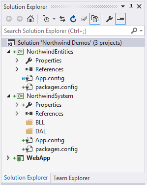

# Northwind Demos  

The Northwind Demos solution illustrates the use of CRUD maintenance forms on a table-by-table basis for an existing database.

The demo focuses on the tables for the Purchasing/Inventory system of Northwind Traders.

