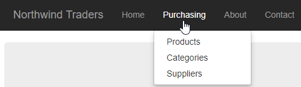

# Using a `Web.sitemap` for Site Navigation

A `Web.sitemap` can be used as an alternative to placing hard-coded links in the `Site.master` file.

## Create a Sitemap File

To create a sitemap, right-click on the web application project and choose Add -> New Item.... Then select the "Site Map" file, leaving the name of the file as the default (which is "Web.sitemap").

Inside the sitemap, you create XML tags for each page you want in your navigation menu.

For example, consider the following sitemap file:

```xml
<?xml version="1.0" encoding="utf-8" ?>
<siteMap xmlns="http://schemas.microsoft.com/AspNet/SiteMap-File-1.0" >
  <siteMapNode title="Root">
    <siteMapNode url="~/Default.aspx" title="Home" />
    <siteMapNode title="Purchasing" url="~/Purchasing">
      <siteMapNode url="~/Purchasing/AddEditProduct.aspx" title="Products" />
      <siteMapNode url="~/Purchasing/AddEditCategory.aspx" title="Categories" />
      <siteMapNode url="~/Purchasing/AddEditSupplier.aspx" title="Suppliers" />
    </siteMapNode>
    <siteMapNode url="~/About" title="About" />
    <siteMapNode url="~/Contact" title="Contact" />
  </siteMapNode>
</siteMap>
```

That will produce the following menu:



## Edit the `Site.master`

To use the sitemap in your master page, replace the original site navigation with an `<asp:Menu>` and some other code as follows.

Replace the following:

```html
<ul class="nav navbar-nav">
    <li><a runat="server" href="~/">Home</a></li>
    <li><a runat="server" href="~/About">About</a></li>
    <li><a runat="server" href="~/Contact">Contact</a></li>
</ul>
```

with the following:

```html
<asp:Menu ID="SiteNav" runat="server" DataSourceID="SiteNavDataSource"
    CssClass="" Orientation="Horizontal" StaticDisplayLevels="1" IncludeStyleBlock="false"
    StaticMenuStyle-CssClass="nav navbar-nav" StaticSelectedStyle-CssClass="active"
    DynamicMenuStyle-CssClass="dropdown-menu" EnableViewState="false" EnableTheming="false">
</asp:Menu>
<script>
    $(function () {
        $('#SiteNav').next().removeAttr('style');
    });
</script>
<asp:SiteMapDataSource ID="SiteNavDataSource" runat="server"
    ShowStartingNode="false"  />
```
